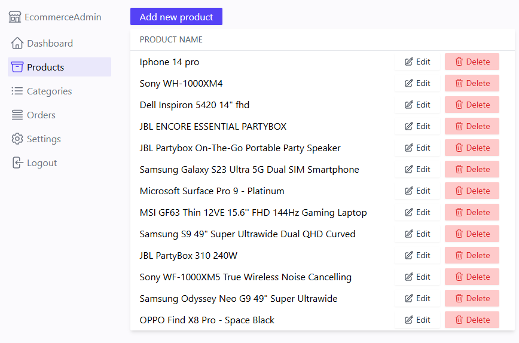
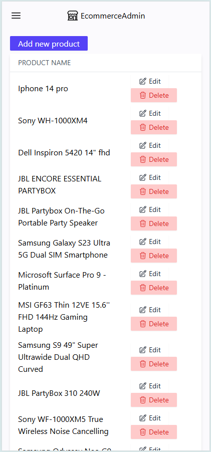

# E-commerce Admin Panel (Built with Next.js)

Welcome to the E-commerce Admin Panel repository! This project provides a comprehensive backend management system for an e-commerce platform, built using Next.js, Tailwind CSS, NextAuth.js for authentication, and AWS S3 for file storage.

## 🚀 Overview

This application serves as the control center for your e-commerce store. Administrators can manage products, categories, orders, users (if applicable), and other essential aspects of the online shop. It leverages Next.js for a fast and modern development experience, including API routes for backend logic.

## ✨ Key Features (Example - customize as needed)

*   **Secure Authentication:** Robust admin login powered by NextAuth.js with MongoDB adapter.
*   **Product Management:** Create, Read, Update, and Delete (CRUD) products, including details, pricing, and inventory.
*   **Category Management:** Organize products by creating and managing categories.
*   **Order Management:** View and update order statuses. (Extend as per your order processing workflow)
*   **Image & File Uploads:** Seamlessly upload product images and other assets to AWS S3.
*   **Drag & Drop Reordering:** Intuitive interface for reordering items like product images or categories using `react-sortablejs`.
*   **Responsive Design:** Built with Tailwind CSS for a clean and adaptable UI across devices.
*   **User-friendly Interface:** Enhanced with components like `react-spinners` for loading states and `react-sweetalert2` for notifications.

## 🖼️ Screenshots

| Desktop                                              | Mobile                                              |
| ---------------------------------------------------- | --------------------------------------------------- |
|  |  |

## 🚀 Live Demo

### URL: [https://nextjs-ecommerce-front.netlify.app/](https://nextjs-ecommerce-admin-jeric.vercel.app/products)

## 🛠️ Technologies Used

This project is built with a modern and powerful stack:

*   **Core Framework:**
    *   [Next.js](https://nextjs.org/) (v13.4.7): React framework for production - providing SSR, SSG, API routes, and more.
    *   [React](https://reactjs.org/) (v18.2.0): JavaScript library for building user interfaces.
*   **Styling:**
    *   [Tailwind CSS](https://tailwindcss.com/) (v3.3.2): A utility-first CSS framework for rapid UI development.
    *   [PostCSS](https://postcss.org/) (v8.4.24) & [Autoprefixer](https://github.com/postcss/autoprefixer) (v10.4.14): Used in the Tailwind CSS build process.
*   **Authentication:**
    *   [NextAuth.js](https://next-auth.js.org/) (v4.22.1): Authentication for Next.js applications.
    *   [`@auth/mongodb-adapter`](https://www.npmjs.com/package/@auth/mongodb-adapter) (v1.0.0) / [`@next-auth/mongodb-adapter`](https://www.npmjs.com/package/@next-auth/mongodb-adapter) (v1.1.3): MongoDB adapter for NextAuth.js to store session and user data.
*   **Database:**
    *   [MongoDB](https://www.mongodb.com/): NoSQL document database.
    *   [Mongoose](https://mongoosejs.com/) (v7.3.1): Elegant MongoDB object modeling for Node.js, used within API routes.
*   **File Storage (Cloud):**
    *   [AWS SDK for JavaScript v3 (`@aws-sdk/client-s3`)](https://docs.aws.amazon.com/sdk-for-javascript/v3/developer-guide/getting-started-nodejs.html) (v3.367.0): For interacting with Amazon S3 to store images and other files.
    *   [AWS SDK v2 (`aws-sdk`)](https://aws.amazon.com/sdk-for-node-js/) (v2.1413.0): (Note: Consider consolidating to v3 if possible, but listed as per package.json).
*   **API & Utilities:**
    *   [Axios](https://axios-http.com/) (v1.4.0): Promise-based HTTP client.
    *   [Multiparty](https://github.com/pillarjs/multiparty) (v4.2.3): For parsing `multipart/form-data` requests, essential for file uploads.
    *   [mime-types](https://www.npmjs.com/package/mime-types) (v2.1.35): Utility for determining content types of files.
*   **UI Enhancements:**
    *   [React SortableJS](https://github.com/SortableJS/react-sortablejs) (v6.1.4) & [SortableJS](https://sortablejs.github.io/Sortable/) (v1.15.0): For drag-and-drop functionality.
    *   [React Spinners](https://www.davidhu.io/react-spinners/) (v0.13.8): Loading spinner components.
    *   [React SweetAlert2](https://github.com/limshanyao/react-sweetalert2) (v0.5.2): Beautiful, customizable alerts.
*   **Deployment Specific:**
    *   [`@netlify/plugin-nextjs`](https://www.npmjs.com/package/@netlify/plugin-nextjs) (v4.40.0): Optimizes Next.js builds for deployment on Netlify.
*   **CLI Tools (as dependencies - review if they can be devDependencies):**
    *   [`aws-cli`](https://www.npmjs.com/package/aws-cli) (v0.0.2): Potentially used in scripts for AWS interactions.

## Prerequisites

*   Node.js (v16.x or later recommended)
*   npm or yarn
*   MongoDB instance (local or cloud-hosted like MongoDB Atlas)
*   AWS Account with an S3 bucket configured and IAM credentials with S3 access.

## ⚙️ Getting Started

1.  **Clone the repository:**
    ```bash
    git clone https://github.com/jericrealubit/ecommerce-admin.git
    cd ecommerce-admin
    ```

2.  **Install dependencies:**
    ```bash
    npm install
    # or
    yarn install
    ```

3.  **Set up Environment Variables:**
    Create a `.env.local` file in the root of the project and add the following environment variables. Replace the placeholder values with your actual credentials.

    ```env
    # MongoDB Connection URI
    MONGODB_URI=your_mongodb_connection_string_here

    # NextAuth.js Configuration
    NEXTAUTH_URL=http://localhost:3000 # For development. Use your production URL for deployed app.
    NEXTAUTH_SECRET=your_super_secret_nextauth_key # Generate a strong random string

    # Optional: Google Provider for NextAuth (if you're using it)
    # GOOGLE_CLIENT_ID=your_google_client_id
    # GOOGLE_CLIENT_SECRET=your_google_client_secret

    # AWS S3 Configuration
    AWS_ACCESS_KEY_ID=your_aws_access_key_id
    AWS_SECRET_ACCESS_KEY=your_aws_secret_access_key
    AWS_S3_BUCKET_NAME=your_s3_bucket_name
    AWS_S3_REGION=your_s3_bucket_region # e.g., us-east-1

    # Base URL for your application (can be same as NEXTAUTH_URL in dev)
    NEXT_PUBLIC_URL=http://localhost:3000
    ```
    *   You can generate a `NEXTAUTH_SECRET` using `openssl rand -base64 32` in your terminal.

4.  **Run the development server:**
    The scripts use `set HTTPS=true`. This is a Windows command.
    *   **For Windows:**
        ```bash
        npm run dev
        ```
    *   **For macOS/Linux:** You might need to adjust the script in `package.json` or run:
        ```bash
        HTTPS=true next dev
        ```
    Open [https://localhost:3000](https://localhost:3000) (note HTTPS) with your browser to see the result. Your browser might show a security warning for the self-signed SSL certificate in development; you can usually proceed.

## 📜 Available Scripts

In the project directory, you can run:

*   `npm run dev`:
    Runs the app in development mode with HTTPS.
    Open [https://localhost:3000](https://localhost:3000) to view it.
    *(Note: `set HTTPS=true` is Windows-specific. macOS/Linux users might need `HTTPS=true next dev`)*

*   `npm run build`:
    Builds the app for production to the `.next` folder.

*   `npm run start`:
    Starts the production server (after running `npm run build`) with HTTPS.
    *(Note: `set HTTPS=true` is Windows-specific. macOS/Linux users might need `HTTPS=true next start`)*

*   `npm run lint`:
    Runs ESLint to check for code style issues and potential errors.

## 🏗️ Project Structure (Simplified Example)

```bash
ecommerce-admin/
├── components/ # Reusable UI components (e.g., forms, tables)
├── lib/ # Utility functions, S3 client, DB connection
├── models/ # Mongoose schemas (Product, Category, User etc.)
├── pages/ # Next.js pages and API routes
│ ├── api/ # API routes (backend logic)
│ │ ├── auth/ # NextAuth.js routes (e.g., [...nextauth].js)
│ │ ├── products.js
│ │ ├── categories.js
│ │ └── upload.js # For S3 uploads
│ ├── _app.js # Custom App component (e.g., for NextAuth SessionProvider)
│ ├── login.js # Admin login page
│ └── index.js # Main dashboard after login
├── public/ # Static assets
├── styles/ # Global styles (if any beyond Tailwind)
├── .env.local # Environment variables (ignored by Git)
├── tailwind.config.js # Tailwind CSS configuration
├── postcss.config.js # PostCSS configuration
├── package.json
└── README.md
```


## 🚀 Deployment

*   **Vercel:** The easiest way to deploy your Next.js app is to use the [Vercel Platform](https://vercel.com/new?utm_medium=default-template&filter=next.js&utm_source=create-next-app&utm_campaign=create-next-app-readme).
*   **Netlify:** This project includes `@netlify/plugin-nextjs`, which optimizes Next.js builds for Netlify. You can deploy directly by connecting your Git repository to Netlify.

Remember to configure all necessary environment variables on your deployment platform.

## 🤝 Contributing

Contributions are welcome! If you have suggestions or want to improve the project:

1.  Fork the Project
2.  Create your Feature Branch (`git checkout -b feature/AwesomeAdminFeature`)
3.  Commit your Changes (`git commit -m 'Add some AwesomeAdminFeature'`)
4.  Push to the Branch (`git push origin feature/AwesomeAdminFeature`)
5.  Open a Pull Request

## 📄 License

This project is licensed under the [MIT License](LICENSE.md) - see the `LICENSE.md` file for details (Consider adding an MIT License file if you don't have one).

---

Happy Managing!
